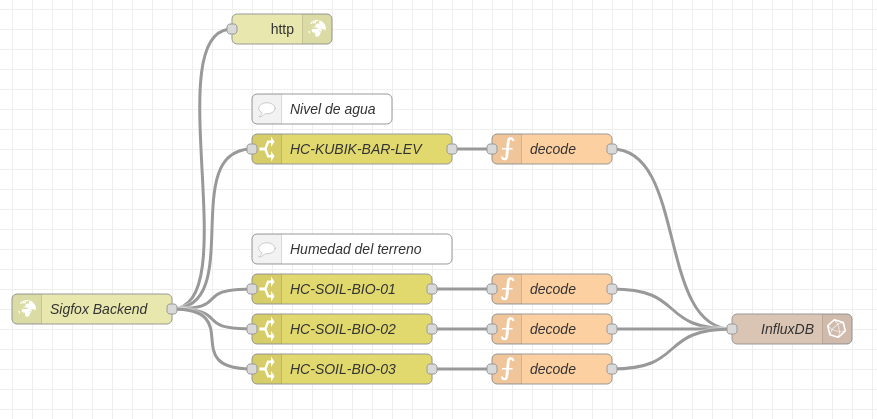

# Bioswale - Sensores de humedad del terreno Sigfox

Sistema de monitorización IoT de humedad del suelo (soil moisture) y altura de agua en terrenos (bioswale). Utiliza sensores **TEROS 10** (humedad del terreno) y **S-8010 SMART LINE** (nivel hidrostático), conectados a dispositivos **HC-ANA-SIG-Z1** (Sigfox), con procesamiento de datos mediante Node-RED.

## Arquitectura del sistema

```
Sensores HC-ANA-SIG-Z1 (Sigfox)
        │
        ▼
Backend Sigfox (callback DATA ADVANCED)
        │  POST JSON
        ▼
Node-RED (webhook /sigfox/bioswale)
        │
        ├─ Switch (identifica sensor por device ID)
        │       │
        │       ▼
        │  Decoder (función JS por tipo de sensor)
        │       │
        │       ▼
        └─ InfluxDB (bucket: bioswale, org: tecnalia)
```

## Sensores

El proyecto utiliza dos tipos de sensores, conectados a dispositivos HC-ANA-SIG-Z1:

### Sensor de humedad del terreno — TEROS 10 (METER Group)

Sensor de contenido volumétrico de agua (VWC) del suelo. Mide la permitividad dieléctrica del suelo a 70 MHz para determinar la humedad, minimizando efectos de salinidad y textura.

| Campo | Valor |
|---|---|
| Fabricante | [METER Group](https://metergroup.com/es/products/teros-10/) |
| Modelo | **TEROS 10** |
| Tipo en el sistema | HC-SOIL-BIO |
| Magnitud | Contenido Volumétrico de Agua (VWC) |
| Canales | 1 (canal 1: VWC) |
| Rango VWC | 0.00–0.64 m³/m³ (calibración mineral) |
| Resolución | 0.001 m³/m³ |
| Precisión (suelo mineral) | ±0.03 m³/m³ (EC solución < 8 dS/m) |
| Precisión (calibración específica) | ±0.01–0.02 m³/m³ |
| Frecuencia de medición dieléctrica | 70 MHz |
| Salida | 1000–2500 mV |
| Tensión de alimentación | 3.0–15.0 VDC |
| Rango de temperatura operativa | -40 °C a 60 °C |
| Unidad | m³/m³ |

### Sensor de nivel hidrostático — S-8010 SMART LINE (SMERI)

Transmisor de presión sumergible para medición de nivel de líquidos por presión hidrostática. Mide la presión en la membrana separadora del sensor sumergido y la compara con la presión atmosférica mediante un capilar integrado en el cable.

| Campo | Valor |
|---|---|
| Fabricante | [SMERI International](https://smeri-international.com/smeri-s-8010/) |
| Modelo | **S-8010 SMART LINE** |
| Tipo en el sistema | HC-BAR |
| Magnitud | Altura de columna de agua (nivel hidrostático) |
| Canales | 1 (canal 1: presión) |
| Rango de presión | 0–1 bar a 0–20 bar |
| Diámetro | 24 mm |
| Principio de medición | Presión hidrostática (membrana separadora) |
| Referencia atmosférica | Tubo de aire integrado en el cable |
| Grado de protección | IP68 |
| Unidad | mm |

## Inventario de dispositivos

### Humedad del terreno (TEROS 10)

| Nombre | Device ID Sigfox | Coordenadas | Descripción |
|---|---|---|---|
| HC-SOIL-BIO-01 | `C0F8CC` | 41.4170, 2.1352 | Sensor de humedad del terreno |
| HC-SOIL-BIO-02 | `C0F09B` | 41.4170, 2.1352 | Sensor de humedad del terreno |
| HC-SOIL-BIO-03 | `C0FB1E` | 41.4170, 2.1352 | Sensor de humedad del terreno |

### Nivel hidrostático (S-8010 SMART LINE)

| Nombre | Device ID Sigfox | Coordenadas | Descripción |
|---|---|---|---|
| HC-KUBIK-BAR-LEV | `2031F3C` | 41.5419, 2.2353 | Sensor de presión de agua (nivel) |

## Configuración del backend Sigfox

### Callback

| Parámetro | Valor |
|---|---|
| Callback type | SERVICE / DATA ADVANCED |
| Channel | URL |
| Url pattern | `https://node-red.tecshm.com/sigfox/bioswale` |
| HTTP Method | POST |
| Send SNI | True |
| Header | `Authorization` |
| Header value | `Basic YWFtaW46c3htX26jX25yXzczOTgq` |
| Content type | `application/json` |

### Body del callback

```json
{
    "device": "{device}",
    "data": "{data}",
    "time": {time},
    "seqNumber": {seqNumber},
    "lqi": "{lqi}",
    "linkQuality": {linkQuality},
    "fixedLat": {fixedLat},
    "fixedLng": {fixedLng},
    "operatorName": "{operatorName}",
    "countryCode": {countryCode},
    "deviceTypeId": "{deviceTypeId}",
    "duplicates": {duplicates},
    "computedLocation": {computedLocation}
}
```

## Flujo Node-RED



El flujo está respaldado en `Node-RED backup/flows.json`. Su estructura es:

1. **HTTP Input** (`POST /sigfox/bioswale`): Recibe los callbacks del backend Sigfox.
2. **HTTP Response**: Devuelve respuesta al backend Sigfox.
3. **Switch nodes**: Cada sensor tiene un nodo switch que filtra por `msg.payload.device` (device ID Sigfox). El mensaje entrante se envía en paralelo a todos los switches.
4. **Decoder (function nodes)**: Cada switch conecta a una función JavaScript que decodifica la trama hexadecimal del sensor.
5. **InfluxDB Output**: Los datos decodificados se almacenan en InfluxDB (bucket: `bioswale`, org: `tecnalia`, measurement: `terreno`).

## Decodificación de tramas

Todos los sensores envían tramas de **12 bytes (24 caracteres hexadecimales)** a través de los dispositivos HC-ANA-SIG-Z1. La estructura de la trama es:

```
[B][CCCCCCC][DDDDDDD][EEEEEEE][FF]
 │     │         │         │     │
 │     │         │         │     └─ Últimos 2 caracteres (no usados en el cálculo)
 │     │         │         └─ Canal 3: 7 caracteres hex (posiciones 15-21)
 │     │         └─ Canal 2: 7 caracteres hex (posiciones 8-14)
 │     └─ Canal 1: 7 caracteres hex (posiciones 1-7)
 └─ Batería: 1 carácter hex (posición 0)
```

### Cálculo de voltaje

Para cada canal:

```
voltaje = parseInt(hexSubstring, 16) / 1000000    (en voltios)
```

### Cálculo de humedad del terreno (VWC) — TEROS 10

El contenido volumétrico de agua se calcula mediante una fórmula polinómica cúbica a partir del voltaje del canal 1 convertido a milivoltios:

```
mV = voltaje × 1000
VWC = 4.824×10⁻¹⁰ × mV³ − 2.278×10⁻⁶ × mV² + 3.898×10⁻³ × mV − 2.154
```

Límites: mínimo 0 m³/m³, máximo 0.90 m³/m³. El resultado se redondea a 4 decimales.

### Cálculo de altura de agua — S-8010 SMART LINE

La altura de la columna de agua se calcula a partir del voltaje del canal 1:

```
altura (mm) = ((1.4 × voltaje) + 0.004) × 1000
```

## Estructura del proyecto

```
bioswale/
├── README.md                              # Este archivo
├── nodered.png                            # Diagrama del flujo Node-RED
├── sensor-soil-moisture.js                # Decoder: humedad del terreno (VWC) — TEROS 10
├── sensor-presion.js                      # Decoder: nivel hidrostático — S-8010 SMART LINE
├── sensor-presion-test.js                 # Decoder de test (presión, device ID de prueba)
└── Node-RED backup/
    └── flows.json                         # Backup del flujo Node-RED completo
```

## Base de datos

| Parámetro | Valor |
|---|---|
| Motor | InfluxDB 2.0 |
| URL | `http://192.168.1.6:8086` |
| Organización | `tecnalia` |
| Bucket | `bioswale` |
| Measurement | `terreno` |
